1- Proje dosyasını local'inize alın.

2- İlk olarak kafka-setup dizinine gidip "docker compose up" komutunu çalıştırın

3- Main-Service dizinine gidip "docker compose up" komutunu çalıştırın

4- Payment ve Invoice mikro-service'lerin bulunduğu dizinlerde ayrı ayrı "docker compose up" komutunu çalıştırın

5- Projenin backend kısmı bu şekilde çalışıyor olacaktır.

6- Frontend klasörünün içindeki simple-ecommerce dizinine gidin ve "npm run dev" komutunu çalıştırın

7- Projenin frontend kısmı da bu şekilde çalışıyor olacaktır. 

8- Tarayıcınınzda localhost:5173 adresine gidin

9- Sizi Login sayfası karşılayacaktır.

10- Doğal olarak henüz bir hesabınız olmadığı için önce kayıt olmanız gerekmektedir.

11- create an account linkiyle Register sayfasına yönlendirileceksiniz.

12- Bir hesap oluşturun. Hesap başarıyla oluşturulduğunda tekrar Login sayfasına yönlendirileceksiniz

13- Oluşturduğunuz hesapla giriş yapın.

14- Hesabım kısmında bilgilerinizi güncelleyebilirsiniz.

15- Sol taraftaki filter-bar aracılığıyla ürünleri filtreleyebilirsiniz.

16- Ürünleri sepete ekleyebilir, sepetten çıkarabilir ve sepettekiler için ödeme yaparak sipariş oluşturabilirsiniz.

17- Dilerseniz çıkış yap kısmından oturumunuzu sonlandırabilirsiniz.

Projenin ekran görüntüleri:

Login Sayfası:
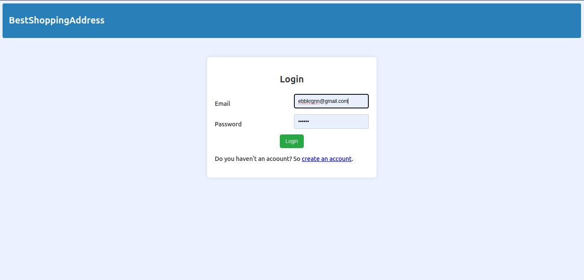

Anasayfa: 
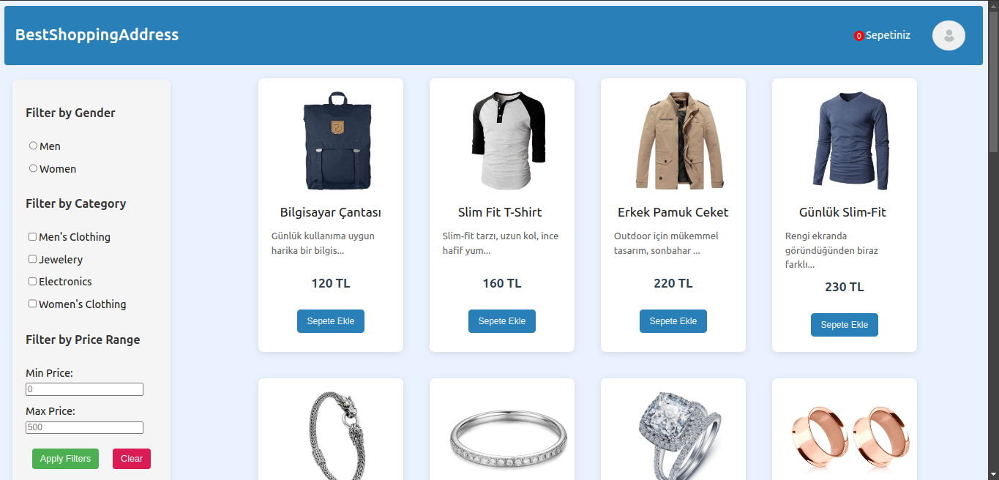

Profil Sayfası:
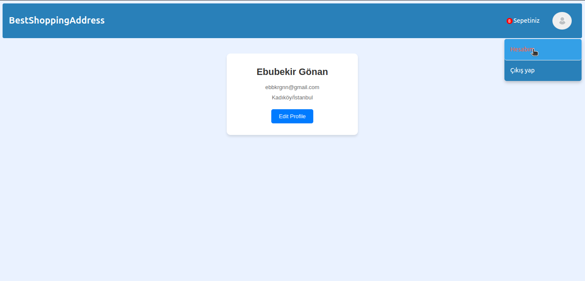

Profil Sayfasında Düzenleme:
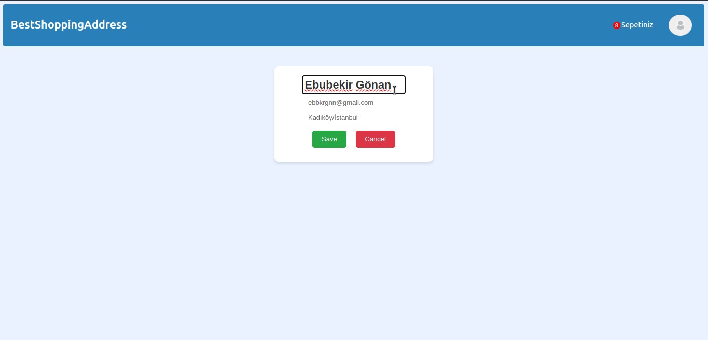

Cinsiyete Göre Filtreleme:
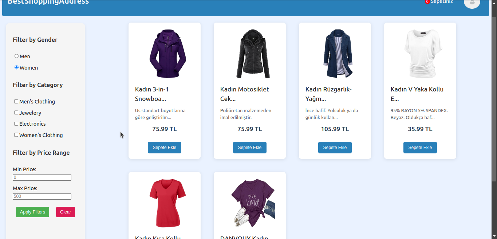

Kategoriye Göre Filtreleme:
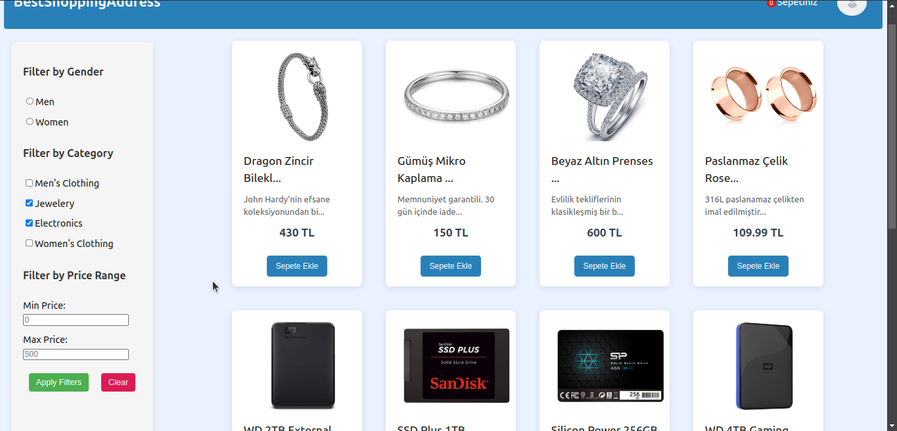

Fiyata Göre Filtreleme:
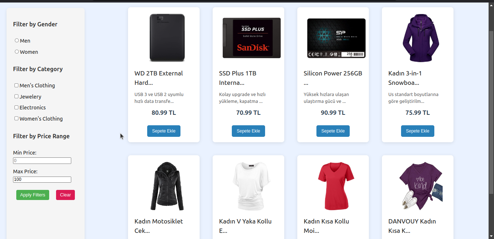

Sepet Ekleme:
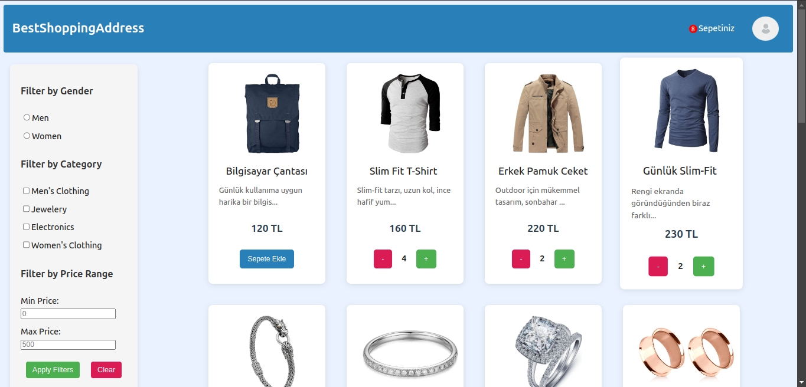

Sepet İşlemleri
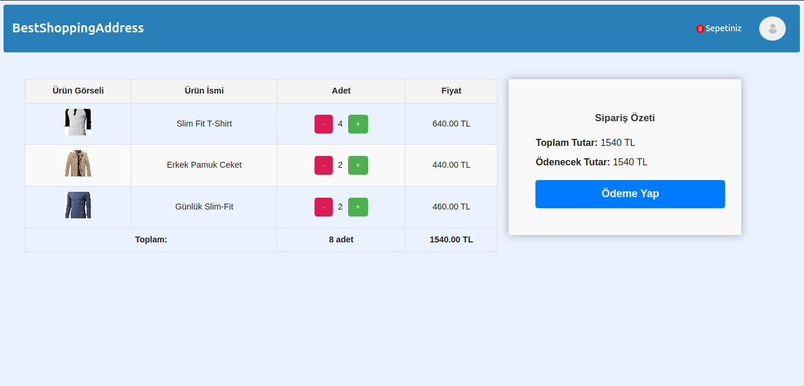

Ödeme:
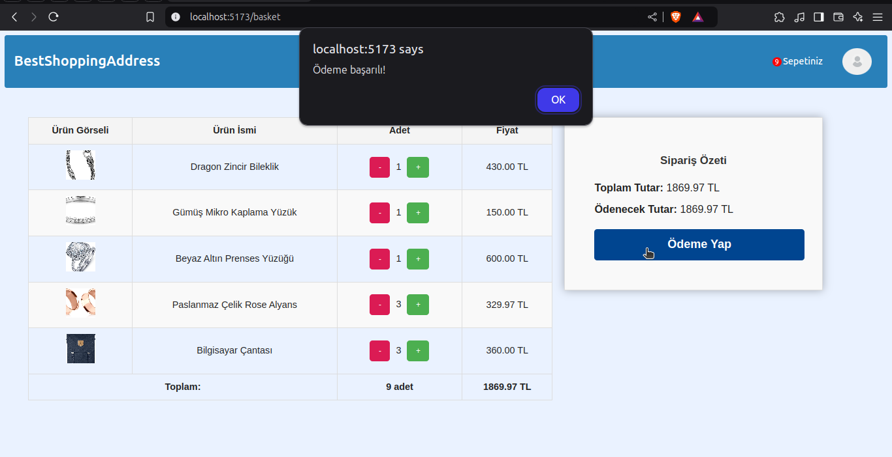

Redis Kullanımında Öncesi ve Sonrası(işlemin kaç ms sürdüğüne bakabilirsiniz):

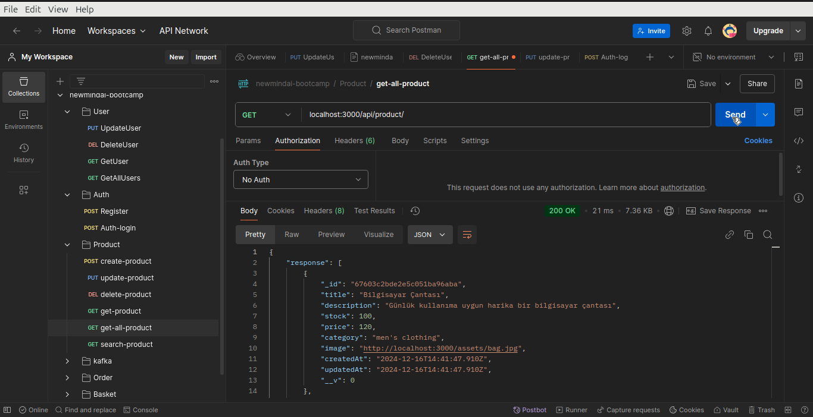

Docker Konteynırları:
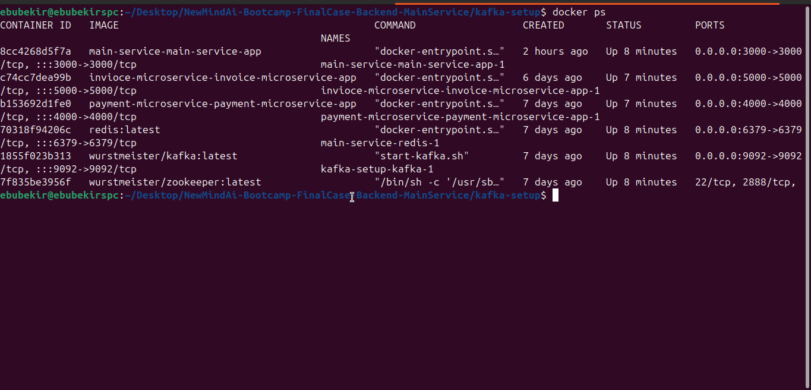

JWT kontrolü:
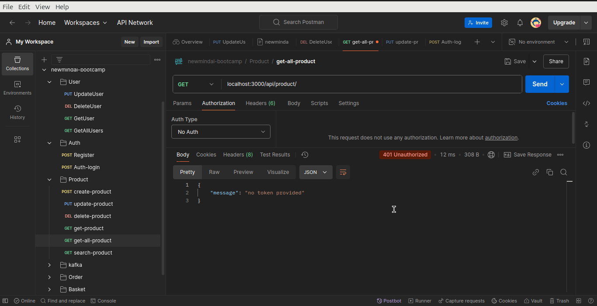
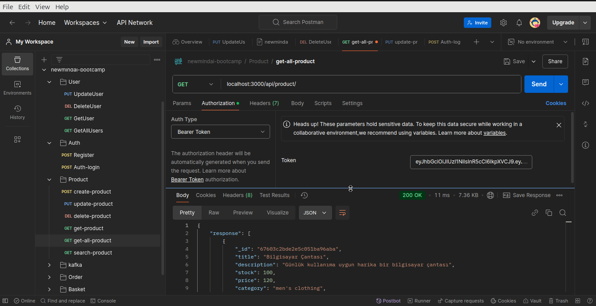

Ödeme sonrası payment ve invoice mikroservislerinin log'ları(ürün id'si ve adedi mesaj olarak gönderilmiştir.)
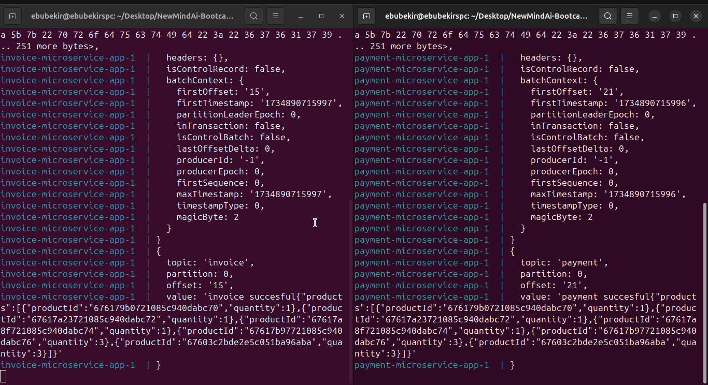

